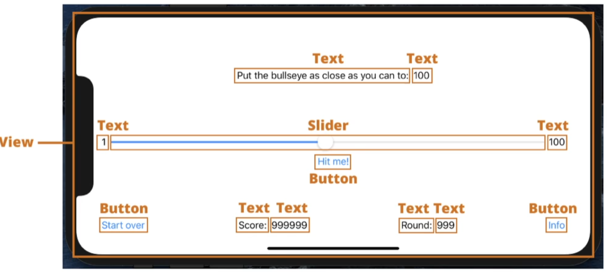
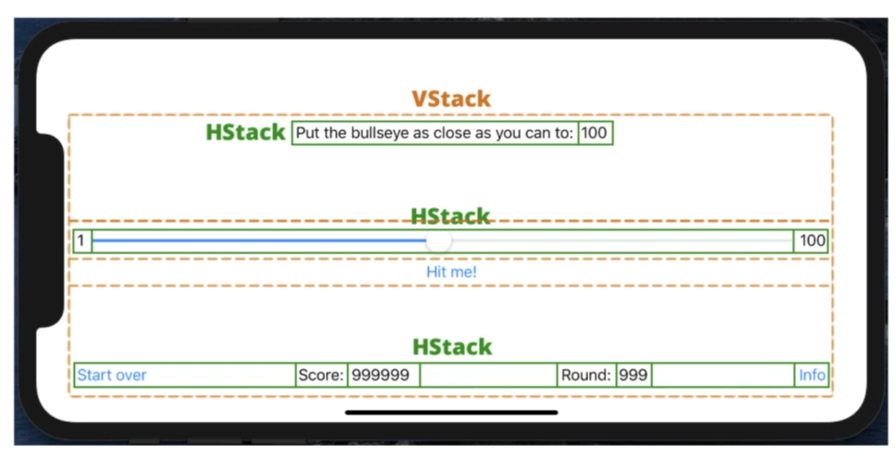
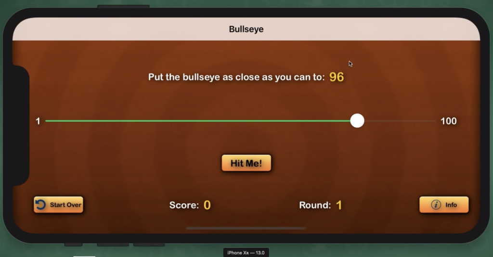
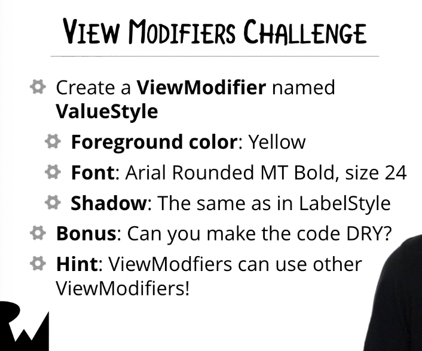
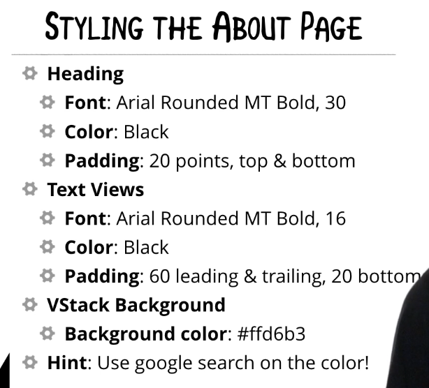

# TP 2: Swift UI

## Création

- Créer un projet vide "Single View App" nommée "Bull's Eyes SwiftUI" en sélectionnant l'option "SwiftUI"
- Le lancer une première fois: ▶
- Utilisez (`cmd + click`) pour afficher la popup de modification
- Personnaliser le texte, la couleur, passer en gras
- Ajouter un bouton: "Hit me !"
- Ajouter une action à ce bouton pour `print` un message dans la console
- Ajouter un `state` dans `ContentView`:

```swift
@State var alertIsVisible = false
```

- Changer sa valeur dans la lambda `action` du `Button`:

```swift
 self.alertIsVisible = true
 ```

- À la fin du bloc `body`, ajouter:

```swift
.alert(isPresented: $alertIsVisible) {
    return Alert(
      title: Text(...),
      message: Text(...),
      dismissButton: .default(Text(...))
    )
}
```

- `$alertIsVisible` sera automatiquement passé à `false` en dismissant l'`Alert`

- Dans les settings du projet, décocher l'orientation portrait
- Faire pivoter le Simulator
- Dans `ContentView_Preview`, spécifier la taille d'écran pour la preview ([reférence](https://www.paintcodeapp.com/news/ultimate-guide-to-iphone-resolutions)):

```swift
.previewLayout(width: 896, height: 414) () //<= iphone 11 Max Pro )
```

- Passer le volet Preview d'XCode en dessous du volet code: `Editor > Layout > Canvas on bottom`

- Ajouter les `View` et utiliser l'IDE pour ne pas trop coder manuellement:




- Utilisez le bouton "+"
- Utilisez le drag & drop (dans le canvas ou dans le code)
- Utilisez la popup `cmd + click`
- Encapsuler des vues dans une autre: "embed in HStack/Button/..."
- Espacer des vues: `Spacer()`
- Ajouter du padding: `.padding(.bottom, 20)`

## Gameplay

- ajouter une nouvelle variable au State:

```Swift
@State var sliderValue = 50.0
```

- Utilisez la dans le slider:

```swift
Slider(value: self.$sliderValue, in 1..100)
```

- Utiliser l'interpolation pour afficher cette valeur dans l'`Alert`:

```swift
let interpolatedString = "Hello \(name)!"
```

- Rendre cette valeur plus "humaine" avec `.rounded()` et la stocker dans une variable `let roundedValue: Int` avec un cast

- Ajouter une méthode qui renvoie les points du tour courant, avec une fausse valeur pour l'instant:

```swift
 func pointsForCurrentRound()  -> Int {
   // 100 - la différence entre la target et la valeur donnée
   return 999
  }
```

- Afficher sa valeur dans la seconde ligne de l'alert
- Ajouter une variable d'état qui sera le nombre à cibler, généré aléatoirement:

```swift
@State var target = Int.random(1..100)
```

- Implémenter le calcul de `pointsForCurrentRound(`
- Créer une méthode  `sliderValueRounded()` pour ne pas dupliquer de code
- Afficher le score total en bas, avec une autre variable `@State`:

```swift
@State var score = ...
```

- Changer la target random a chaque tour (dans le `dismiss` de l'alert)
- Afficher le numéro du round
- Afficher 3 différents textes dans l'alerte en fonction du score
- Ajouter un bonus de 100 points en cas de *perfect* et 50 points en cas de *perfect-1*
- Ajouter la fonctionnalité "Start Over"

## Styling



- Ajouter les images dans "assets"
- ajouter un background: `.background(Image("Background"), alignement: .center)`
- Ajouter ombre au text, changer la police du texte principal en `Arial Rounded MT Bold` avec `.font(Font.custom(...))`
- Faire pareil sur les autres textes, sans copier coller le même code partout: pour cela il faut créer un objet `LabelStyle`

```swift
// Définition
struct LabelStyle: ViewModifier {
  func body(content: Content) -> some View {
      // utiliser les modifications de style
  }
}

// Utilisation
.modifier(LabelStyle())
```

- Faire de même pour tous les labels de chiffres: `ValueStyle`:



- Pour ne pas dupliquer la partie `.shadow(color: Color.black, radius: 5, x: 2, y: 2)`, faire utiliser aux deux styles un style `ShadowStyle`
- Styliser les boutons:
  - `LargeTextStyle` avec `size: 18` pour Hit Me
  - `SmallTextStyle` avec `size: 12` pour les autres
  - Background: `.background(Image("Button")`
  - ShadowStyle
  - Texte noir
  - Icônes:
    - ajouter une `HStack` a l'interieur des boutons
    - `.accentColor` pour la couleur des icones

## Navigation

- Ajouter une nouvelle classe `AboutView`
- Copier la partie `_preview` précédente
- Ajouter des `Text` pour donner des infos sur vous et sur le jeu
- Dans `ScreenDelegate`, changer:

```swift
// Avant
contentView = ContentView()

// Après
contentView = NavigationView {
  ContentView()
}
.navigationViewStyle(StackNavigationViewStyle())
```

- Ajouter des titres aux vues:
  - dans ContentView: `.navigationEyesTitle("BullsEyes")`
  - dans AboutView: `.navigationEyesTitle("About")`
- Changer le `Button()` info par un `NavigationLink(destination: AboutView())` avec le même contenu
- Styliser `AboutView`:



- Mettre toute la `VStack` dans un `Group` pour setter le `.background()` dessus afin que le background prenne toute la place disponible.
- Ajouter une icône à l'application
- Tester sur d'autres tailles d'écrans: normalement, ça ne devrait rester propre !
